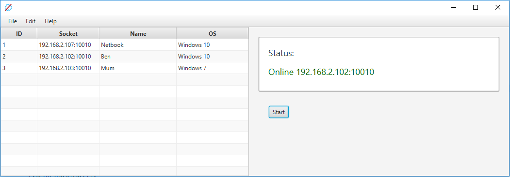

# Uncloud Server

Version 0.01 (Beta)

Created on: 17.09.2017 

Author: Benjamin Leonhardt 

Uncloud ist ein P2P-Netzwerk Programm für den Heimgebrauch.
Wer seine Daten gerne verfügbar hat, aber sie nicht in eine 
Cloud laden will kann diese Software verwenden. 

Uncloud ermöglicht das verfügbarstellen von Dateien und besitzt
einen Chat zur Kommunikation mit den verbundenen Peers.

Dieses Projekt enstand zuhause, um mit meinen Eltern direkt 
Daten ohne Skype, Whatsapp oder Dropbox installieren zu müssen,
austauschen zu können.

Die Kommunikation wird mit gRPC bewerkstelligt. Diese Software
funktioniert zwar ist allerdings unstabil. Es kommt also ab und 
an zu verbindungsabbrüchen. Getestet wurde Sie bisher nur unter
Windows 7 und 10. Es wird zum kompilieren Java benötigt. Das
Projekt wurde als Maven Projekt angelegt und lädt somit alle seine
Dependencies selbst runter. Zum erstellen von eingenständig 
ausführbaren Jar Dateien kann das Projekt mit folgendem Maven Goal
komiliert werden:
* clean package install compile assembly:single kompiliert werden

Danach kann die erstellte Jar mit Java -jar < Dateiname > auf jedem
Rechner mit installierter Java Runtime ausgeführt werden.

Für den Betrieb wird auch Uncloud Client benötigt. Die Clients 
müssen sich alle auf dem Server als Peers anmelden.

  